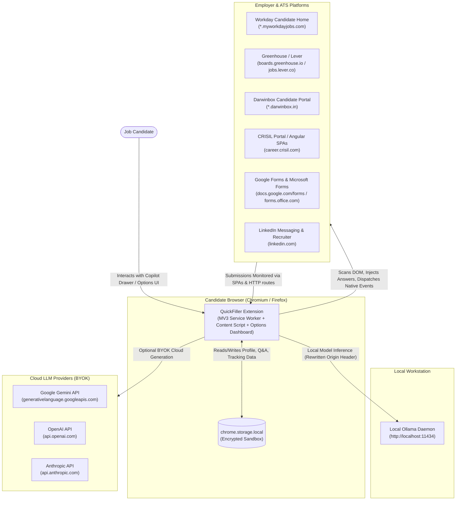
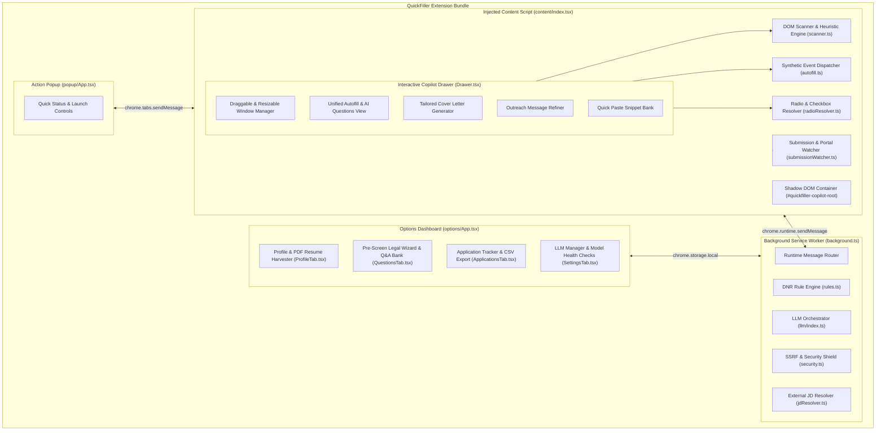
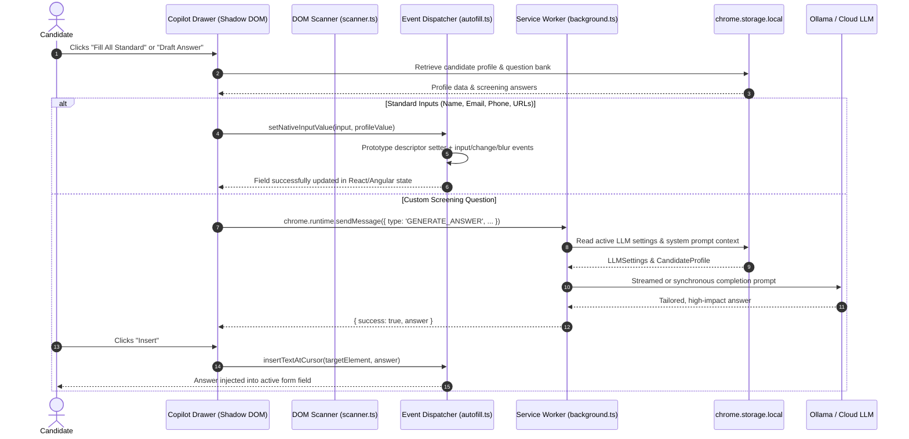
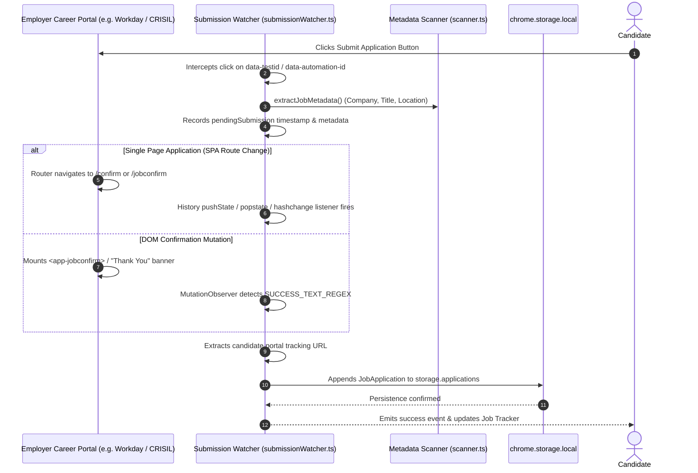
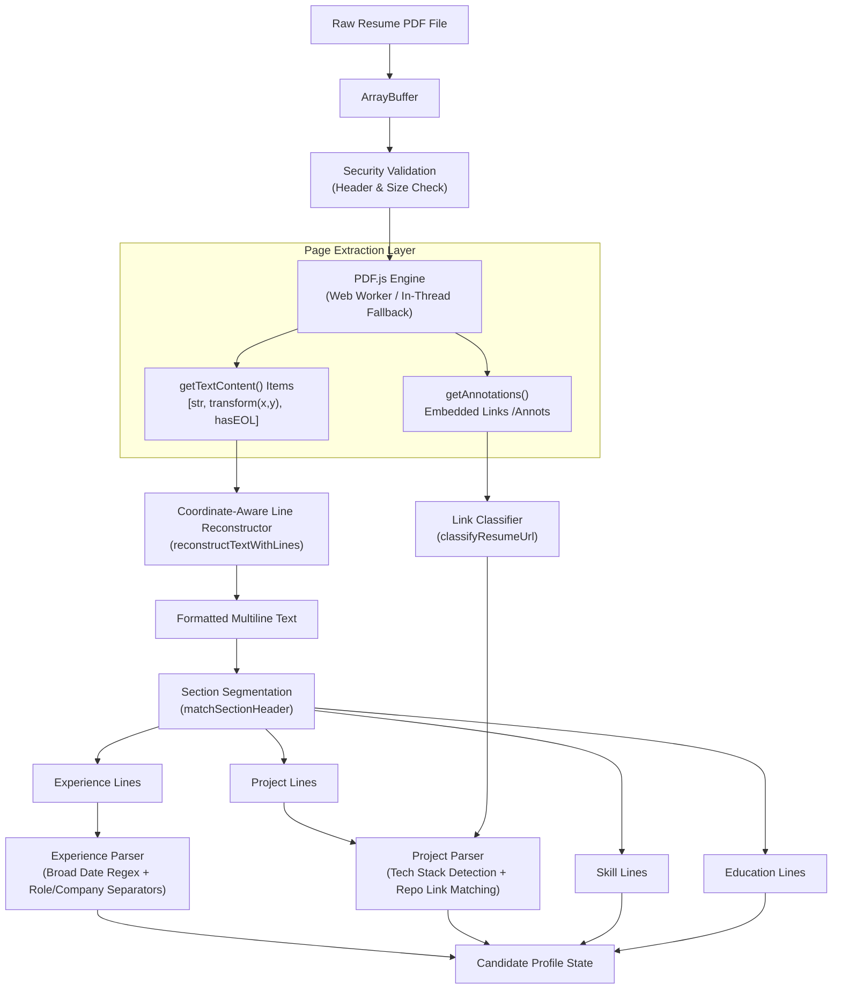

# QuickFiller Architecture & Technical Specifications

> **A 100% Local-First, Privacy-Obsessed Job Application Copilot and Autofill Extension**  
> Supports Chromium (Manifest V3) & Firefox (Manifest V2).

---

## 1. System Overview & Architectural Tenets

QuickFiller is an intelligent browser extension engineered to eliminate the manual friction of job applications while guaranteeing absolute data sovereignty.

### Core Principles
1. **100% Local-First Storage**: All candidate profiles, PDF parsed resumes, confidential screening answers, custom paste items, and tracked job applications reside exclusively in the user's browser sandbox via [`chrome.storage.local`](file:///home/adarsh/Documents/Projects/QuickFiller/src/utils/storage.ts). No analytics, no tracking beacons, no developer-hosted backend databases.
2. **Dual AI Pipeline (Local & BYOK Cloud)**: Zero-cost offline generation through local [Ollama](https://ollama.com/) instances (`llama3.2`, `mistral`, `qwen2.5`) with Declarative Net Request (DNR) CORS rewriting, alongside Bring-Your-Own-Key (BYOK) cloud LLMs (Google Gemini Flash, OpenAI GPT-4o-mini, Anthropic Claude 3.5 Haiku).
3. **Resilient ATS & Form Engine**: Native adapters for enterprise Applicant Tracking Systems (Workday, Darwinbox, CRISIL, SmartRecruiters, Greenhouse, Lever, Google Forms, Microsoft Forms). Bypasses React, Angular, and Vue virtual DOM state trapping through prototype-level synthetic event dispatching.
4. **Isolated Presentation Layer**: Floating Copilot Drawer rendered inside a shadow root (`attachShadow({ mode: 'open' })`) with encapsulated CSS, guaranteeing zero styling conflicts or JavaScript pollution on host pages.

---

## 2. High-Level Architecture (C4 Diagrams)

### Context Diagram (System Level)



---

### Container Diagram (Extension Components)



---

## 3. Data Flow & Sequence Workflows

### 1. Unified Autofill & Question Generation Sequence



---

### 2. Automatic Application Submission Interception



---

## 4. Key Component Deep Dives

### A. DOM Scanner & Heuristic Engine ([`src/utils/scanner.ts`](file:///home/adarsh/Documents/Projects/QuickFiller/src/utils/scanner.ts))
- **Standard Field Detection**: Evaluates attributes (`name`, `id`, `autocomplete`, `placeholder`, `aria-label`, `data-automation-id`) using weighted regex scoring to categorize fields into:
  - First Name, Last Name, Full Name
  - Email Address
  - Phone Number & Phone Extension (specialized regex separating country code, primary number, and extension fields)
  - Address, City, State, Postal Code, Country
  - LinkedIn, GitHub, Portfolio URLs
- **Screening Question Extractor**: Identifies multiline `<textarea>` and custom text fields accompanied by `<label>`, `aria-labelledby`, or preceding heading text. Filters out search bars, promo codes, and standard login fields.
- **ATS Platform Detection**:
  - **Workday**: Detects Workday custom attributes (`data-automation-id="formField-..."`, `data-automation-id="legalNameSection_firstName"`).
  - **Darwinbox**: Resolves Darwinbox custom form fields and floating labels.
  - **CRISIL / Angular SPAs**: Extracts headings (`[class*="align-titleJob"]`, `[class*="jobVwHeading"]`) and handles corporate subdomains (`career.crisil.com` $\rightarrow$ `CRISIL`).
  - **Google Forms & Microsoft Forms**: Scans form group containers (`div[role="listitem"]`, `div[data-automation-id="questionItem"]`) to bind questions with corresponding inputs.

### B. Synthetic Autofill Dispatcher ([`src/utils/autofill.ts`](file:///home/adarsh/Documents/Projects/QuickFiller/src/utils/autofill.ts))
Modern frontend frameworks (React, Angular, Vue) override native DOM property setters (`input.value = '...'`) with internal virtual DOM state trackers. Simply setting `.value` results in values being erased on blur.
QuickFiller overcomes this by:
1. Accessing the underlying native prototype descriptor:
   ```typescript
   const nativeInputValueSetter = Object.getOwnPropertyDescriptor(
     window.HTMLInputElement.prototype,
     'value'
   )?.set;
   nativeInputValueSetter?.call(element, value);
   ```
2. Dispatching a synchronized sequence of synthetic events:
   - `focus` $\rightarrow$ `keydown` $\rightarrow$ `input` (with `{ bubbles: true, composed: true }`) $\rightarrow$ `keyup` $\rightarrow$ `change` $\rightarrow$ `blur`.
3. Multi-frame & ContentEditable Support: Injects text at active caret locations in `contenteditable` elements (e.g. LinkedIn message editors, Rich Text editors).

### C. Radio & Checkbox Engine ([`src/utils/radioResolver.ts`](file:///home/adarsh/Documents/Projects/QuickFiller/src/utils/radioResolver.ts))
Handles complex binary and categorical screening queries (Work Authorization, Visa Sponsorship, Relocation, Gender, Veteran Status):
- Extracts radio groups grouped by `name` or ARIA `role="radiogroup"`.
- Matches options using semantic normalization (`yes`, `no`, `authorized`, `sponsorship required`, `immediate`, `negotiable`).
- Dispatches native click and checked property updates without triggering form validation errors.

### D. Outreach Message Refiner ([`src/entrypoints/content/Drawer.tsx`](file:///home/adarsh/Documents/Projects/QuickFiller/src/entrypoints/content/Drawer.tsx))
Built specifically for candidate outreach on LinkedIn and non-job pages:
- **Dual Output Generation**:
  1. **Connection Request Note**: Strict length enforcement (≤ 300 characters) designed for LinkedIn's connection request limit.
  2. **InMail / Full Pitch**: Structured 100–180 word introductory message highlighting relevant skills, projects, and custom context notes.
- **Persona Adaptation**:
  - `recruiter`: Emphasizes role fit, years of experience, immediate availability, and core tech stack.
  - `technical`: Emphasizes architectural paradigms, engineering methodologies, specific GitHub projects, and open-source contributions.

---

## 5. Security Architecture & Threat Modeling

QuickFiller follows defense-in-depth principles:

### 1. SSRF & Loopback Protection ([`src/utils/security.ts`](file:///home/adarsh/Documents/Projects/QuickFiller/src/utils/security.ts))
When resolving external job descriptions (`FETCH_EXTERNAL_JD`), the background service worker strictly filters URLs through [`isSafeExternalUrl`](file:///home/adarsh/Documents/Projects/QuickFiller/src/utils/security.ts#L13-L74):
- Blocks private IPv4 subnets (`10.0.0.0/8`, `172.16.0.0/12`, `192.168.0.0/16`, `127.0.0.0/8`, `169.254.0.0/16`).
- Blocks private IPv6 ranges (`::1`, `fc00:`, `fd00:`, `fe80:`).
- Disallows loopback domains (`localhost`, `*.localhost`, `*.internal`, `*.local`).
- Enforces strict 10-second request timeouts and a 2.5 MB HTML parsing ceiling.

### 2. Declarative Net Request (DNR) CORS Shield ([`src/utils/rules.ts`](file:///home/adarsh/Documents/Projects/QuickFiller/src/utils/rules.ts))
Local Ollama instances reject cross-origin requests by default. Rather than exposing Ollama to all external websites:
- QuickFiller uses Chrome's `declarativeNetRequest` to rewrite the `Origin` request header exclusively for requests originating from the extension (`chrome-extension://<id>`).
- Re-sets `Access-Control-Allow-Origin` to the extension origin only, preventing malicious web pages on the user's browser from communicating with the local Ollama daemon.

### 3. Secret Redaction & Sanitization
All API keys (Gemini, OpenAI, Anthropic) are masked and stripped from logs, error payloads, and diagnostic outputs using [`redactSecrets`](file:///home/adarsh/Documents/Projects/QuickFiller/src/utils/security.ts#L79-L98).

---

## 6. Client-Side PDF Resume & Link Harvester Pipeline

The PDF resume parser ([`src/utils/pdfParser.ts`](file:///home/adarsh/Documents/Projects/QuickFiller/src/utils/pdfParser.ts)) enables client-side biographical extraction without sending files to third-party OCR services:



### Architectural Highlights
1. **Coordinate-Aware Line Reconstruction**: PDF content streams do not encode newlines. The parser tracks vertical coordinate deltas (`deltaY > 3.5`) and `hasEOL` flags to accurately reconstruct visual lines and horizontal gaps.
2. **Flexible Section Segmentation**: Supports diverse typographical layouts (colons, markdown, pipes, spaced letters like `E X P E R I E N C E`, and synonyms like `WORK HISTORY` or `EMPLOYMENT HISTORY`).
3. **Broad Date & Role Engine**: Handles `MM/YYYY`, `YYYY/MM`, `Month Year`, and end dates (`Till Date`, `Ongoing`, `Current`) alongside delimiter splitting (`|`, `-`, `,`, `at`).
4. **Resilient Worker Architecture**: Resolves worker URLs via `browser.runtime.getURL` and automatically falls back to in-thread parsing if Gecko MV2 CSP limits trigger in Firefox.

